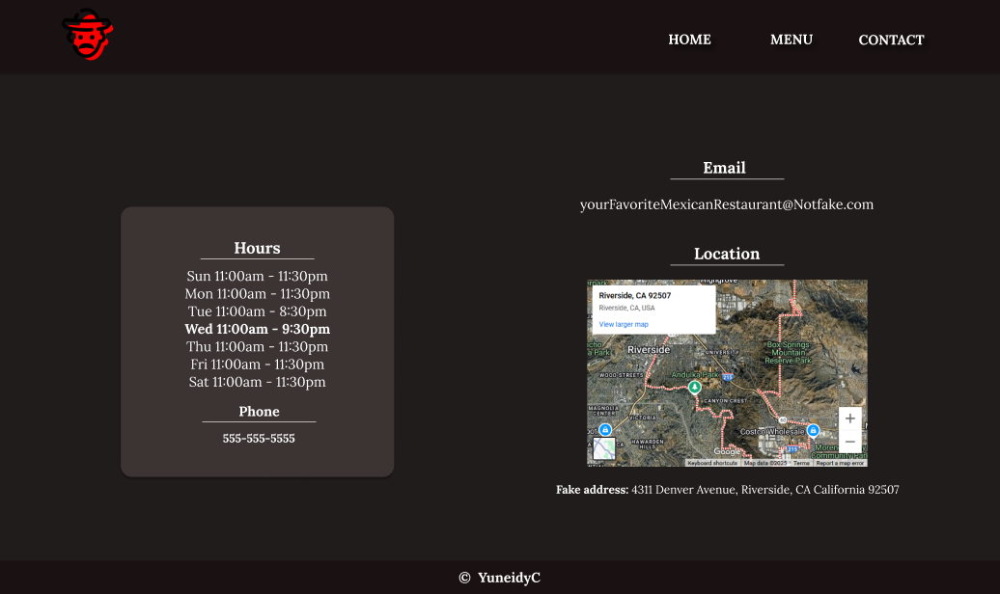

# The Odin Project - Restaurant Page

- [**Restaurant Page**](#RestaurantPage)
  - [**About the project**](#about-the-project)
  - [**Lighthouse**](#lighthouse)
  - [**Tech stack**](#tech-stack)
  - [**Design**](#design)
  - [**Test it out**](#test-it-out)

## About the project

This is the solution to the [Restaurant page](https://www.theodinproject.com/lessons/node-path-javascript-restaurant-page) in the [Javascript Course](https://www.theodinproject.com/paths/full-stack-javascript/courses/javascript) courses on The Odin Project.

## Lighthouse

## Tech stack

<!-- markdownlint-disable MD033 -->

    
    
    
    
    

<!-- markdownlint-enable MD033 -->

## Design

This is the reference design, made in Figma by me.

### Home page

### Menu page

### Contact page

These are the reference colors and fonts:

## Test it out

You can test this [here](https://yuneidyc.github.io/TheOdinProject-RestaurantPage/).
